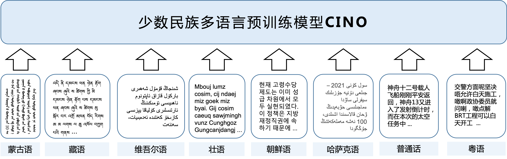

# CINO: Pre-trained Language Model for Chinese Minority
[**中文说明**](https://github.com/ymcui/Chinese-Minority-PLM/) | [**English**](https://github.com/ymcui/Chinese-Minority-PLM/blob/main/README_EN.md)

<p align="center">
    <br>
    
    <br>
</p>
<p align="center">
    <a href="https://github.com/ymcui/Chinese-Minority-PLM/blob/master/LICENSE">
        
    </a>
</p>
Pre-trained Language Model (PLM) has been an important technique in the recent natural language processing field, including multilingual NLP research. In order to promote the NLP research for Chinese minority languages, the Joint Laboratory of HIT and iFLYTEK Research (HFL) has released the first specialized pre-trained language model **CINO** (**C**hinese m**INO**rity PLM).

You may also be interested in,

- Chinese MacBERT: https://github.com/ymcui/MacBERT
- Chinese ELECTRA: https://github.com/ymcui/Chinese-ELECTRA
- Chinese BERT series: https://github.com/ymcui/Chinese-BERT-wwm
- Chinese XLNet: https://github.com/ymcui/Chinese-XLNet
- Knowledge Distillation Toolkit - TextBrewer: https://github.com/airaria/TextBrewer
- Model Pruning Toolkit - TextPruner：https://github.com/airaria/TextPruner

More resources by HFL: https://github.com/ymcui/HFL-Anthology

## News

Dec 17, 2021 **We have released a model pruning toolkit TextPruner**. Check https://github.com/airaria/TextPruner
Oct 25, 2021 **CINO-large and Wiki-Chinese-Minority（WCM）dataset have been released.**

## Guide
| Section | Description |
|-|-|
| [Introduction](#Introduction) | Introduction to CINO |
| [Download](#Download) | Download links and how-to-use |
| [Quick Load](#Quick-Load) | Learn how to quickly load our models through [🤗Transformers](https://github.com/huggingface/transformers) |
| [Dataset for Chinese Minority Languages](#Dataset-for-Chinese-Minority-Languages) | Introduce Wiki-Chinese-Minority (WCM) and other datasets |
| [Results](#Results) | Results on several datasets |


## Introduction
Multilingual Pre-trained Language Model, such as mBERT and XLM-R, adopts masked language model (MLM) and other self-supervised approaches to support multilingual and cross-lingual abilities in NLP systems, using training corpus in various languages.

However, due to the scarcity of corpus in Chinese minority languages and neglection of relevant research, current multilingual PLMs are not capable of dealing with these languages.

We made the following contributions.

- We propose **CINO** (**Ch**inese m**INO**rity PLM), which is built on [XLM-R](https://github.com/facebookresearch/XLM). We further pre-train XLM-R with corpus in Chinese minority languages. 

- To evaluate CINO as well as other multilingual PLMs, we also propose a new classification dataset called **Wiki-Chinese-Minority（WCM）**, which is built on Wikipedia.

- The experimental results on WCM, Tibetan News Classification Corpus (TNCC),  and KLUE-TC (YNAT) show that CINO achieves state-of-the-art performances.

CINO supports the following languages:

- Chinese，中文（zh）
- Tibetan，藏语（bo）
- Mongolian (Uighur form)，蒙语（mn）
- Uyghur，维吾尔语（ug）
- Kazakh (Arabic form)，哈萨克语（kk）
- Korean，朝鲜语（ko）
- Zhuang，壮语
- Cantonese，粤语（yue）

<p align="center">
    <br>
    
    <br>
</p>


## Download

### Direct Download

We provide CINO-large of PyTorch version. We will release more models in the future.

* **`CINO-large`**：24-layer, 1024-hidden, 16-heads, 585M parameters  

| Model | Size | Google Drive | Baidu Disk |
| :------- | :---------: |  :---------: |  :---------: |
| **CINO-large-v2** | **1.6GB** | - | **[PyTorch（pw: 3fjt）](https://pan.baidu.com/s/19wks3DpI2gXxAD8twN12Jg?pwd=3fjt)** |
| **CINO-base-v2** | **705MB** | - | **[PyTorch（pw: qnvc）](https://pan.baidu.com/s/11qOk7YaGRsJJl3QviNR0IA?pwd=qnvc)** |
| **CINO-large** | **2.2GB** | **[PyTorch](https://drive.google.com/file/d/1-79q1xLXG2QQ4cdoemiRQVlWrNNRcZl2/view?usp=sharing)** | **[PyTorch (pw: wpyh)](https://pan.baidu.com/s/1xOsUbwwY1K6rMysEvGXSLg?pwd=wpyh)** |

### Download from 🤗transformers

You can also download our models from 🤗transformers Model Hub, including PyTorch and Tensorflow2 models.
| Model | Size | transformers model hub URL |
| :------- | :---------: |  :---------: |
| **CINO-large-v2** | **1.6GB** | https://huggingface.co/hfl/cino-large-v2 |
| **CINO-base-v2** | **705MB** | https://huggingface.co/hfl/cino-base-v2 |
| **CINO-large** | **2.2GB** | https://huggingface.co/hfl/cino-large |

How-to: click the model link that you wish to download (e.g., https://huggingface.co/hfl/cino-large) → Select "Files and versions" tab  → Download!

### How-To-Use

There are three files in PyTorch model:

```
pytorch_model.bin        # Model Weight
config.json              # Model Config
sentencepiece.bpe.model  # Vocabulary
```
CINO uses exactly the same neural architecture with XLM-R, which can be direclty loaded using `XLMRobertaModel` class in [Transformers](https://huggingface.co/transformers/).

```
from transformers import XLMRobertaTokenizer, XLMRobertaModel
tokenizer = XLMRobertaTokenizer.from_pretrained("PATH_TO_MODEL_DIR")
model = XLMRobertaModel.from_pretrained("PATH_TO_MODEL_DIR")
```

## Quick Load
With [🤗Transformers](https://github.com/huggingface/transformers), the models above could be easily accessed and loaded through the following codes.

```
from transformers import XLMRobertaTokenizer, XLMRobertaModel
tokenizer = XLMRobertaTokenizer.from_pretrained("MODEL_NAME")
model = XLMRobertaModel.from_pretrained("MODEL_NAME")
```

The actual model and its `MODEL_NAME` are listed below.

| Actual Model | MODEL_NAME |
| - | - |
| CINO-large-v2 | hfl/cino-large-v2 |
| CINO-base-v2 | hfl/cino-base-v2 |
| CINO-large | hfl/cino-large |

## Dataset for Chinese Minority Languages

### Wiki-Chinese-Minority（WCM）
We built a new classification dataset **Wiki-Chinese-Minority (WCM)**. The dataset covers Mongolian, Tibetan, Uyghur, Cantonese, Korean, Kazakh, and Chinese, including ten categories of art, geography, history, nature, natural science, people, technology, education, economy, and health.

We use [weighted-F1](https://scikit-learn.org/stable/modules/generated/sklearn.metrics.f1_score.html) for evaluation. 

| Name | Google Drive | Baidu Disk |
| :------- |  :---------: |  ----------- |
| **Wiki-Chinese-Minority（WCM）** | [Google Drive](https://drive.google.com/file/d/1VuP_inhluxq7d71xjHSYRRncIwWgjy_L/view?usp=sharing) | [iFLYTEK Cloud (pw: y9sw)](https://pan.baidu.com/s/1fZ8ZgPezFxNFdUYchpxfgQ?pwd=y9sw) |

Dataset Statistics:

| Category | mn | bo | ug | yue | ko | Kk | zh-Train | zh-Dev | zh-Test |
| :------: | :---------: | :---------: | :---------: | :---------: | :---------: | :---------: | :---------: | :---------: | :---------: |
| Art |  437  | 129 |3|3877|10962|   802   |2657|335|331|
| Geography | 145 | 0 |256|30488|17121|347|12854|1644|1589|
| History | 470 | 125 |0|6434|10491|588|1771|248|227|
| Nature | 90	| 0	| 7	| 8880	| 5250 |	5050 |	1105 |	110 |	134 |
| Natural Science | 5366	| 129 |	20	| 3365	| 6654	| 4183 |	2314	| 287	| 317 |
| People | 428 |	0 |	0 |	23163 |	9057	| 870 |	7706 |	924 |	953 |
| Technology | 112	| 1	| 8	| 3293 |	10997 |	635 |	1184 |	152 |	134 |
| Education | 212	| 0	| 0	| 2892	| 5193	| 13973	| 936	| 118	| 130 |
| Economy | 0 | 0	| 0	| 5192	| 7343	| 2712	| 922	| 109	| 113 |
| Health | 0	| 110	| 6	| 2721	| 2994	| 2176	| 551	| 73	| 67 |
| **Total** | 7260 | 494 | 300 | 90305 | 86062 | 31336 | 32000 | 4000 | 3995 |

Note:

* The dataset includes two folders: `zh` and `minority`
* zh: train/dev/test in Chinese
* minority: test set for all languages

**The dataset is still in its alpha stage, with possible modifications in the future.**

## Results

We evaluate on YNAT, TNCC, and Wiki-Chinese-Minority. For each dataset, we use the same hyper-params for all models.

### Korean Text Classification (YNAT)
* **KLUE-TC (a.k.a. YNAT)** is released by KLUE.
* Dataset Source: [KLUE benchmark](https://klue-benchmark.com)
* Dataset Details: [KLUE: Korean Language Understanding Evaluation](https://arxiv.org/pdf/2105.09680.pdf)

| #Train | #Dev  | #Test | #Classes | Metric   |
| :------: |:------: | :------: | :------: | :------: |
| 45,678 | 9,107 | 9,107 | 7        | macro-F1 |

Hyper-params: Initial LR1e-5, batch size 16.

Results:

| Model | Dev |
| :------- | :-----: |
| XLM-R-large<sup>[1]</sup> | 87.3 |
| XLM-R-large<sup>[2]</sup> | 86.3 |
| **CINO-large** | **87.4** |

 > [1] The results in the original paper.  
 > [2] Reproduced result using the same initial LR with CINO-large.


### Tibetan News Classification Corpus（TNCC）
* **Tibetan News Classification Corpus (TNCC)** is released by Fudan University.
* Dataset Source: [Tibetan-Classification](https://github.com/FudanNLP/Tibetan-Classification)
* Details of dataset: [End-to-End Neural Text Classification for Tibetan](http://www.cips-cl.org/static/anthology/CCL-2017/CCL-17-104.pdf)

| #Train<sup>[1]</sup> | #Dev | #Test | #Classes | Metric   |
| :----: | :----: | :----: | :----: | :----: |
|  7,363  | 920 | 920  | 12        | macro-F1 |

Hyper-params:  initial LR 5e-6, batch size 16

Results:

| Model | Dev | Test |
| :------- | :---------: | :---------: |
| TextCNN | 65.1 | 63.4 |
| XLM-R-large | 14.3 | 13.3 |
| **CINO-large** | **71.3** | **68.6** |

> Note: there is no official train/dev/test split in this dataset. We split the dataset with the ratio of 8:1:1.

### Wiki-Chinese-Minority

We use Chinese training set to train our model and test on other languages (zero-shot). We use weighted-F1 for evaluation.

Hyper-params: initial LR 7e-6, batch size 32.

Results:

| Model | MN | BO | UG | YUE | KO | KK | ZH | Average |
| :------- | :---------: | :---------: | :---------: | :---------: | :---------: | :---------: | :---------: | ----------- |
| XLM-R-large |  **33.2**  | 22.9 |77.4|71.4|44.2|   11.6   |88.4|49.9|
| **CINO-large** | 20.0 | **31.5** |**88.8**|**72.3**|**46.2**|**26.1**|**89.6**|**53.5**|

## Demo Code

See `examples`. It currently includes

* [examples/WCM](examples/WCM/README_EN.md)：Fine-tuning and zero-shot evaluation on WCM
* [examples/TNCC](examples/TNCC/README_EN.md)：Fine-tuning on TNCC
* [examples/YNAT](examples/YNAT/README_EN.md)：Fine-tuning on YNAT


## Technical Details

TBA

## Follow Us
Follow our official WeChat account to keep updated with our latest technologies!


## Issues
Please submit an issue.
